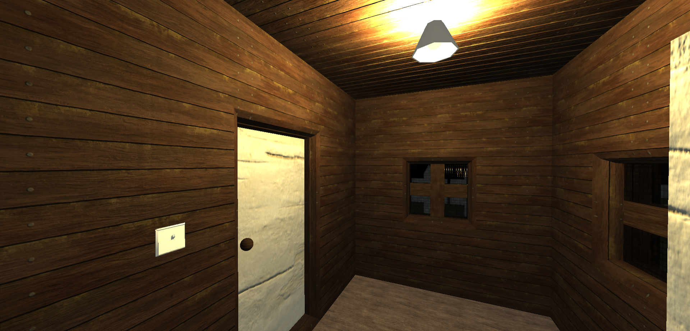
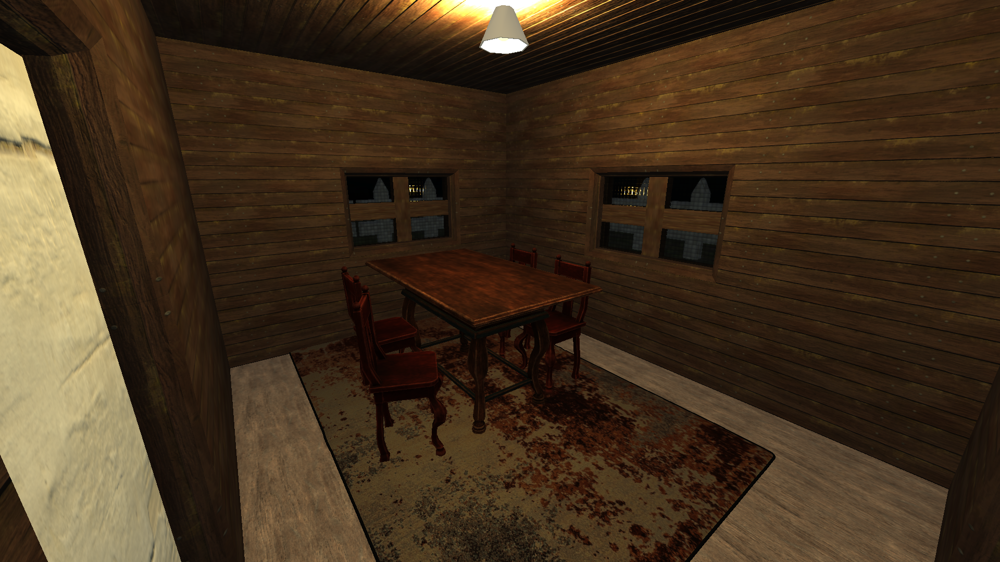
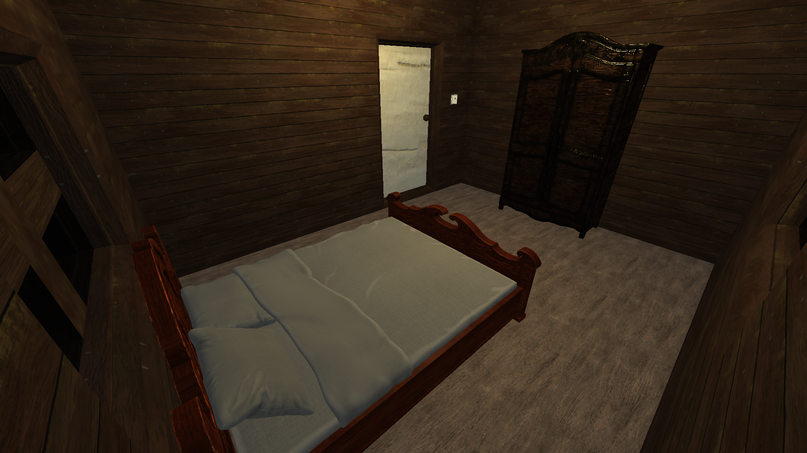

# CG-Project

Project developed for Computer Graphics class.

This project consists of a 3D first-person interactive environment, with the ability to move using __WASD__, as well as 
interact with certain objects, i.e., doors, light switches, using the __E__ key.

Source code was written in Javascript, and is fully supported by the graphical library _three.js_, as well other
additional libraries:
- _Octree_ and _Capsule_, for player interactions and collisions
- _PointerLockControls_ for mouse/camera interaction
- _GLTFLoader_ for loading imported objects, including trees and furniture
- _three-csg-ts_, a constructive solid geometry library, compatible with _three.js_

The player can move and jump around the environment, as collisions are fully supported.
They also have the ability to turn on/off their flashlight, using the __F__ key, and change cameras with __C__ key.

Some screenshots taken inside the game:

